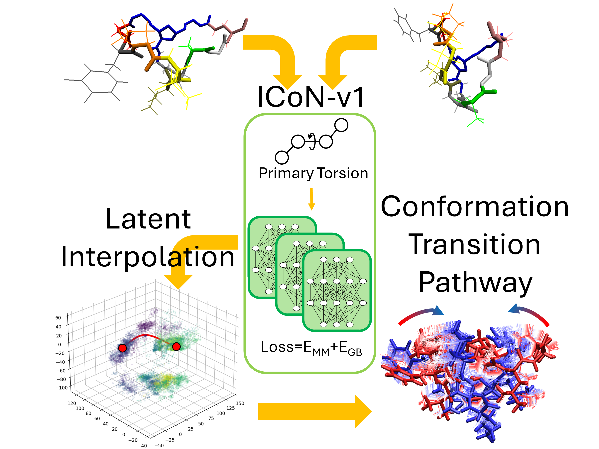

  

## Internal Coordinate Net version 1 (ICoN-v1) for Sampling Conformational Transition Pathway

1. It uses BAT internal coordinate with primary torsional rotation.

2. It can generate full atomistic detail conformational transition.

3. It use Transformer and Molecular Mechanic Energy (loss function) during training. 

4. It can reveal the concerted and sequential torsional rotation during transition.
